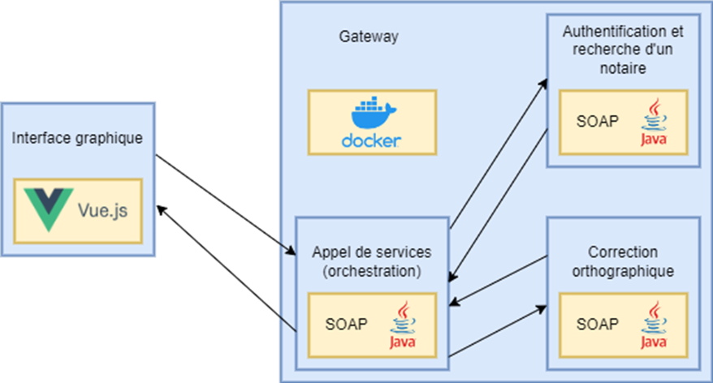
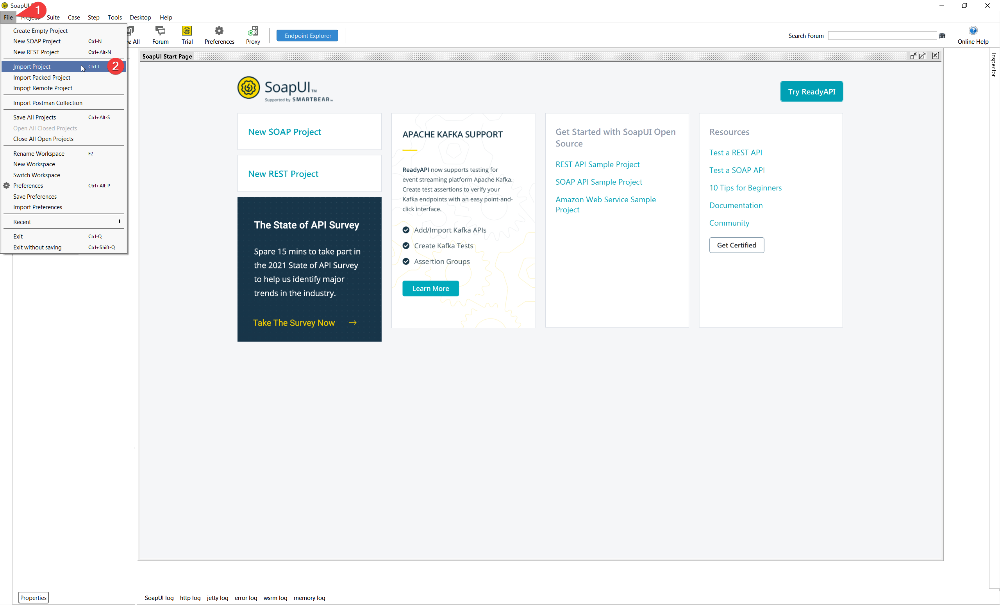
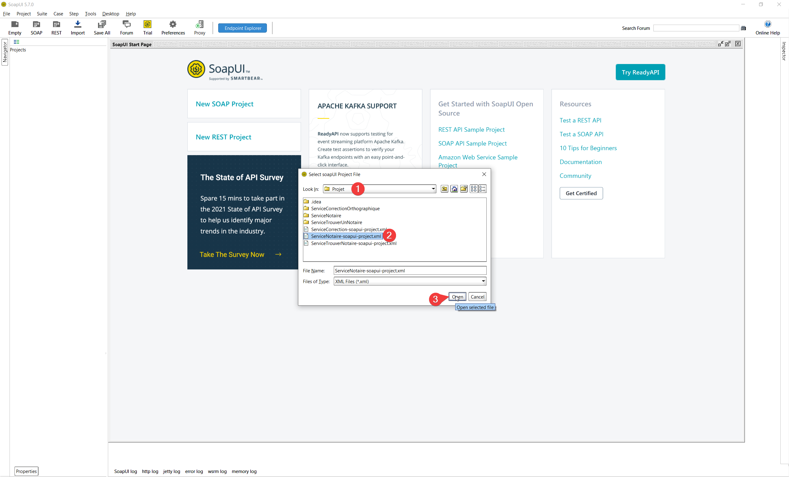
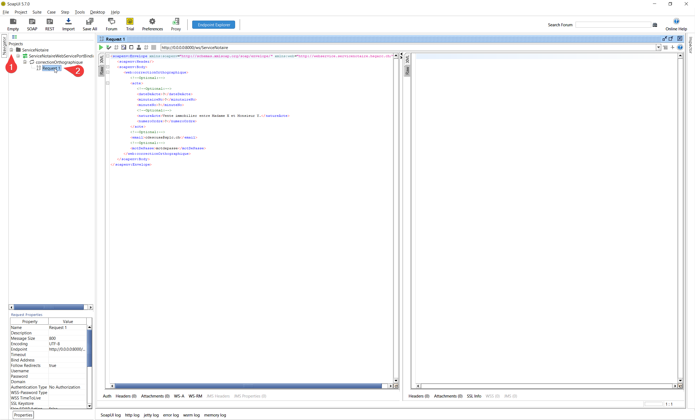
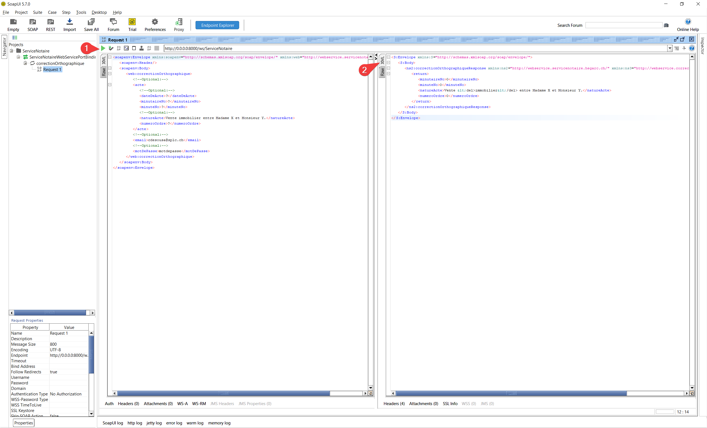
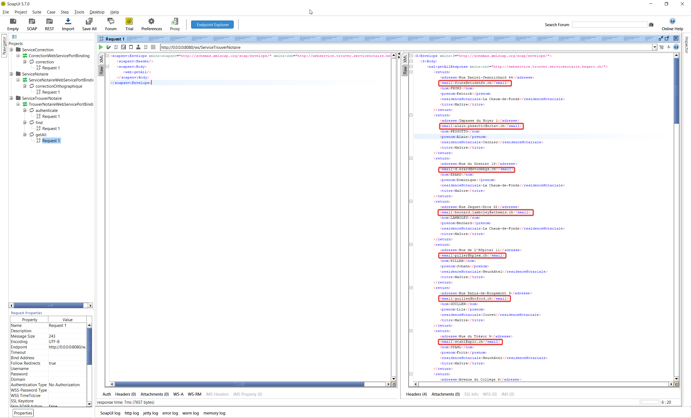

# Code du proof of concept pour le cours "Architecture du SI"
> Marlene Mezzi, Artur Ribeiro, Robin Rolle, Stéphane Prestinari

## Schéma du proof of concept



Vous remarquerez que l'interface Vue.js du diagramme n'a pas été implémenter pour ce proof of concept.

Le proof of concept est composé de trois services:
1. ServiceNotaire: Service d'orchestration permettant de proposer une api unifiée à la future application web
2. ServiceCorrectionOrthographique: Service proposant, comme son nom l'indique, de trouver les erreures d'orthographes dans un text donné. (ajouter la connection à l'API microsoft dans le schéma)
3. ServiceTrouverUnNotaire: Service qui dispose de la liste des notaires

## Exécution
Pour lancer les différents services qui composent se proof of concept, il est nécessaire d'avoir Docker installé et de le lancé avec la commande suivante:
```shell
docker compose up -d
```

## Test
Nous ne proposons pas de client à ce stade. Il est donc nécessaire de télécharger un client SOAP permettant de faire les requêtes de tests.
Tout logiciel devrait fonctionner, mais nous recommandons [SoapUI](https://www.soapui.org/tools/soapui/). C'est ce logiciel que nous
allons d'ailleurs utiliser dans les étapes suivantes.

### 1. Télécharger SoapUI
Télécharger le logiciel à cette adresse: [https://www.soapui.org/tools/soapui/](https://www.soapui.org/tools/soapui/).
Installer le logiciel selon les instruction par défaut de l'installateur.

### 2. Importer les projet préfaits
Les 3 fichiers XML ci-dessous se trouvant à la racine du projet sont des exportations de projet préfait pour chacun des services:
2. [ServiceNotaire-soapui-project.xml](images/ServiceNotaire-soapui-project.xml) pour ServiceNotaire.
1. [ServiceCorrection-soapui-project.xml](ServiceCorrection-soapui-project.xml) pour ServiceCorrectionOrthographique.
3. [ServiceTrouverNotaire-soapui-project.xml](ServiceTrouverNotaire-soapui-project.xml) pour ServiceTrouverUnNotaire.

#### Voici comment importer un projet dans SoapUI et exécuter une requête:
Sélectionner le menu File -> Import Project.

Sélectionner un des fichiers XML.

Dérouler ensuite la hérarchie du projet jusqu'à arriver au requêtes préfaites et cliquer dessus pour les ouvrir.

Pour finir cliquer sur le bouton "play" vert. La requête sera exécutée et la réponse affichée dans la partie de droite. Pour avoir une meilleure vue du XML en réponse, il est possible de cliquer sur l'onglet "XML"

Le principe reste le même pour les 2 autres projets et les autres requêtes. Il est bien sûr possible d'utiliser d'autres valeurs dans les paramêtres.

Les nom d'utilistateurs sont tout les emails des notaires retournés par la requête "getAll" du ServiceTrouverNotaire. Le mots de passe de tout les utilisateur est le suivant: "motdepasse".

